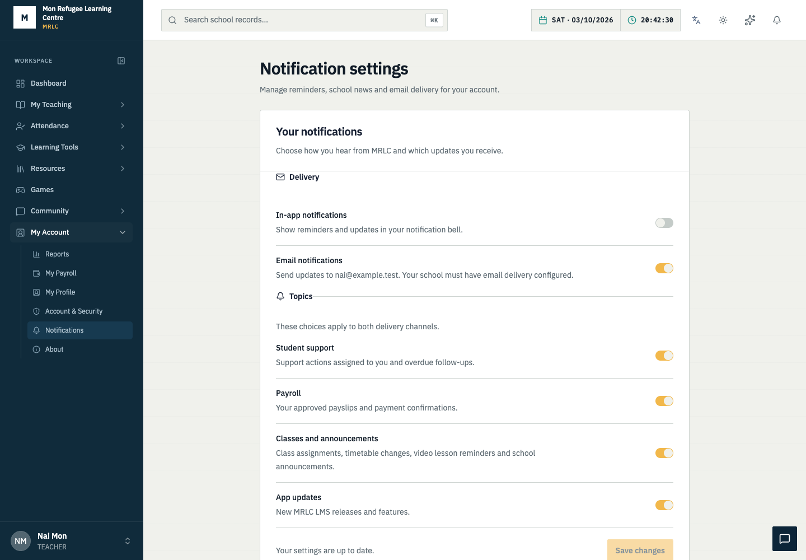
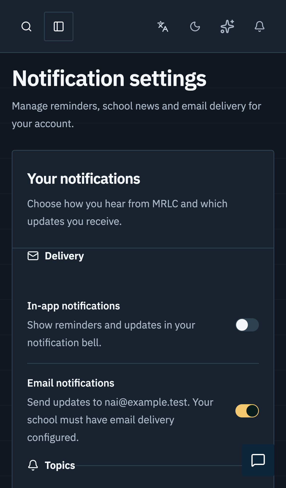

# MRLC LMS module audit — 3 October 2026

This pass removes the AI Assistant, adds notification settings, and fixes confirmed reliability, access-control, delivery, and accessibility issues. It inventories 659 HTTP route registrations across 23 source files and exercises the module screens, existing regression suites, and selected real database/API workflows. Inventory and smoke coverage are not proof that every branch, role combination, or production integration is defect-free.

This report records local validation before publication. No production migration, school-data change, deployment, or real email delivery was performed. Tests used generated fixtures, a temporary PostgreSQL database, and SMTP-disabled local servers. Existing untracked Language Quest artwork was left unchanged.

## Confirmed changes

| Priority | Finding | Result and evidence |
| --- | --- | --- |
| High | An unexpired session could retain access after an account was disabled or its role changed. | Authentication now checks the live account for every token, including media-cookie authentication. Disabled, deleted, reassigned, or external-account conversions invalidate stale identity claims. Real-session PostgreSQL tests cover disabling and role changes. Temporary database failures return 503 instead of incorrectly logging the user out with 401. |
| High | Concurrent recovery-code requests could reuse the same MFA recovery code. | Consumption now uses a database compare-and-swap over the stored code list. Concurrent real PostgreSQL requests accept a code once. |
| High | Several Express 4 async handlers could reject outside the error middleware. | Nineteen handlers now forward synchronous errors and promise rejections. Coverage includes sessions/MFA, uploads, presence, and backups. The final route scan finds no explicit async route handler without either a catch or wrapper; this heuristic does not prove all nested asynchronous work is handled. |
| High | A failed notification-delivery ledger update could requeue mail already accepted by SMTP. | SMTP failure handling is separated from receipt bookkeeping. Accepted mail is marked sent and its body cleared before the secondary ledger update. Unit coverage proves a receipt-update failure does not resend. Ambiguous SMTP success followed by a crash/database failure still has at-least-once semantics. |
| Medium | Saving preferences sent database metadata back to a strict API and could fail. | The public contract contains exactly eight booleans. Reads and writes exclude database IDs, timestamps, and ownership fields. Invalid/old responses cannot silently reset settings. Unit, API, and browser round-trips pass. |
| Medium | Disabling topics did not consistently hide existing notifications or stop queued mail. | Topic filters run before feed pagination and unread counting; the worker rechecks preferences and account status before sending queued notification mail. Cancelled mail is cleared. Password recovery remains independent of notification opt-outs. |
| Medium | Video reminders bypassed preference and email-delivery handling; redo requests used the wrong topic. | Video reminders now use the common delivery service transactionally and remain deduplicated per student/activity/day. `HOMEWORK_REDO` follows Homework reminders. Database tests cover opt-out, one queued email, and deduplication. |
| Medium | The notification bell was hidden on mobile, settings lacked a clear destination, and stale refreshes could overwrite newer state. | The bell is available on small screens, the popup fits the viewport, `/notifications/settings` appears in school-user navigation, and refreshes discard superseded responses. Announcements obey notification preferences. |
| Medium | Small brand-colored dashboard/login text failed contrast; password-recovery labels became unreadable in dark mode; timetable filters lacked accessible names. | Dashboard/timetable text accents use stronger light/dark colors, login text accents and input colors are explicit, recovery uses theme tokens, search text has sufficient contrast, and timetable controls have names. Accessibility checks scan settled content in both themes. |
| Medium | Unknown GET API paths fell through to the SPA and returned HTML with status 200. | Unknown `/api` paths now return JSON 404. Both GET and POST probes cover the removed AI endpoint and an unknown route. |
| Maintenance | Production dependency advisories affected mail, database tooling, XML processing, and other transitive packages. | Compatible patches were applied; Prisma packages are aligned at 7.10.0, Nodemailer at 10.0.13, and targeted dependency overrides are recorded in the lockfile. Production audit reports zero known vulnerabilities. See the remaining development advisory below. |

The AI widget, model-provider configuration, server route, and Studio's AI question-generation action have been removed. Chat and manual exam authoring remain covered by regression tests. Historical design documents are marked as historical; dormant translation/history entries do not ship an active assistant.

Notification settings group **Delivery** and **Topics**, show only relevant role options, and provide explicit save/discard actions, unsaved-change feedback, retryable loading, preserved drafts after save errors, and keyboard-operable switches. Teacher topics include Payroll, Classes and announcements, and App updates. Email remains opt-in. Existing notification migrations from the previous release are still required; this pass adds no database migration.

## Module coverage

Every listed domain received route-inventory/error-handling inspection and the applicable existing tests. The depth column describes exercised behavior; it does not imply that all CRUD operations or every role were manually executed.

| Domain | Coverage exercised |
| --- | --- |
| Authentication, users, permissions, sessions, MFA | Unit access policies; live session/account changes; recovery-code concurrency; real login and permission checks; role registry; recovery form and dashboard accessibility |
| Dashboard, navigation, search shell, themes | Desktop/mobile navigation and unavailable-service smoke; dashboard contrast; mobile bell; keyboard menus and route transitions |
| Students, teachers, profiles, admissions | Module smoke; profile tabs/documents/photos browser tests; real private upload/document boundaries; photo policy/cropping and card/PDF unit tests |
| Classes, subjects, attendance, timetable | Module smoke; real read endpoints; subject keyboard tabs; attendance deep-link roster/save regression; date-window, overlap, recurrence, CSV and teacher-scope units; named timetable filters |
| Exams, question bank, Studio, grading, gradebook | Scoring, availability, analytics, rules and persistence units; extensive desktop/mobile creation, editing, publishing, taking, reviewing and grading flows; real rate-limit/isolation checks |
| Homework and classwork | Teacher assignment and student submission browser flows; validation, attachments, privacy, ownership and class-scoping integration tests |
| Flashcards and daily quests | Route/API sweep, flashcard module smoke, daily-quest validation units; full flashcard authoring not exercised against live data |
| Video lessons, activities, notes and playlists | Browser playback/source/editing and learning-workspace tests; real audience, quiz, note privacy, ordered-unit, reminder and linked-activity tests |
| Library, e-library, physical books and documents | Catalog/search/collection browser tests; PDF and EPUB reader regressions; search, archive and title units; official-document/card/PDF units; module smoke |
| News, dictionary and Gutenberg | Route inventory; news/dictionary screen smoke and local read checks where applicable; external provider calls/imports excluded from the live sweep |
| Fees, structures, assignments and discounts | Period/control/report units; real concurrent-payment behavior; failure/retry and missing-record browser tests; finance module smoke |
| Expenses, vendors, budgets and financial reports | Monthly/report units; isolated duty-expense integration; browser failures, form-load boundaries, report filter fidelity and export gating |
| Donations, campaigns and donors | Module smoke, fixed-path API reads, campaign unavailable/retry workflow; payment-provider delivery not exercised |
| Staff, departments, payroll and leave | Module smoke; payroll notification units; department deletion confirmation; short-screen leave dialog regression; fixed-path reads |
| Duties, rosters, performance and student council | Duty/cooking-date units, real duty-expense behavior, roster/definition retry tests, module smoke |
| Cases, conduct, interventions and student success | Module smoke; live read/permission checks; case load retry and visibility copy; intervention error propagation; conduct PDF registration inspected |
| Notifications, announcements and app updates | Public-contract units; teacher payroll/class/release recipient tests; isolated preference/ownership/filtering tests; queued delivery tests; teacher/student desktop/mobile settings and Axe scans |
| Family/guardian portal and external learners | Route/permission policy units, existing allowlists and live-account enforcement inspection; production guardian messaging not exercised |
| Chat, presence, social and streams | Module smoke, chat after AI removal, social-policy units, presence error handling and initial stream/media session validation; long-running multi-client reconnection/load not exercised |
| Learning Quest | Course/content/scoring/voice-policy/classroom/social/final-exam units; route inventory and module smoke; live voice provider and microphone hardware excluded |
| Chess, Checkers, Snake, Neon Snake, Pac-Man, Word Trail and Word Connect | Rules/physics/gesture/control/leaderboard units; fixed-path route sweep; desktop/mobile Word Connect interaction/access tests; live multiplayer load not exercised |
| School settings, branding, roles, backups, health, export and audit log | Module smoke; real role/health API/browser checks; backup-artifact/system-health/export units; error forwarding and safe backup-file response; no restore into production |

[Full HTTP route inventory](module-route-inventory-2026-10-03.tsv) lists methods, paths, files, and source lines. Counts: server 426; Learning Quest 49; exam phase 2 48; exam bank 22; flashcards 15; video learning 13; chess/checkers 11 each; news 9; classwork 8; game controls 7; family/conduct/snake 6 each; notifications/Word Trail 5 each; daily quests 3; Gutenberg/Pac-Man/dictionary 2 each; fees/conduct/payroll PDFs 1 each. Socket event handlers and static upload middleware are outside this HTTP registration count.

## Validation and limits

- **406 unit tests passed**; no skips or failures.
- **29 isolated PostgreSQL integration tests passed**, including concurrent fee payments, MFA recovery use, account changes, private documents, homework and video learning.
- **118 module smoke checks passed**: 59 routes on desktop and mobile with unavailable API responses. These check for runtime crashes and missing routes, not complete functionality.
- **40 existing module regression checks passed**, including failed-load/retry behavior, attendance, report filters, short dialogs and navigation.
- **137 workflow browser checks passed; 3 intentional mobile skips**. Skips are the PDF fullscreen/search-keyboard case and two EPUB desktop wheel/keyboard/fullscreen variants. Reader behavior on mobile is covered by the remaining reader cases.
- **18 live-API browser checks passed.** These cover login, recovery, dashboard accessibility, permissions, sessions, roles, health and timetable filters. No third-party email delivery occurs.
- **163 fixed-path GET API probes**, plus two removed/unknown API probes: 132 returned 200, 9 returned 400 for missing required inputs, 7 returned 403 for role/capability boundaries, and 17 returned 404 for missing fixture records or removed routes. No 5xx responses or transport errors. Parameterized CRUD routes rely on targeted tests rather than blanket writes.
- TypeScript, production build and Prisma validation passed. Nodemailer stream-transport MIME generation, Sharp PNG round-trip, and XML parsing passed. No SMTP connection was made.
- Notification settings passed WCAG 2 A/AA and 2.1 AA Axe scans in light/dark themes, keyboard switching, and a 320px overflow assertion.

The build still includes large lazy-loaded EPUB, 3D, and locale chunks. No bundle-regression threshold or load test was introduced. Real SMTP delivery, external feeds/transcoding/speech hardware, native mobile browsers, production-scale transactions, and backup restoration require deployment-specific verification. Ongoing WebSocket/SSE revocation and prolonged reconnect behavior are not exhaustively covered by this pass.

The production dependency audit reports **0 known vulnerabilities**. The complete audit still reports **7 high findings in one development-only dependency chain** (`shadcn` / `@shadcn/registry` / `ts-morph` / `fast-glob` / `micromatch` / `braces`). The root is [braces stack-exhaustion, GHSA-vfj7-8cjw-p6xm](https://github.com/advisories/GHSA-vfj7-8cjw-p6xm). No patched braces version was available in this audit; npm's proposed shadcn 1.0.0 downgrade was not forced. Avoid passing untrusted glob patterns to the development generator while this remains unresolved. Patched mail behavior was checked against [Nodemailer release notes](https://github.com/nodemailer/nodemailer/releases); XML and Prisma configuration compatibility were verified locally.

Standard checks are `npm run test:unit`, `npm run lint`, `npm run build`, and `npm run audit:prod`. Browser suites use Playwright's configured desktop/mobile projects. Integration suites are opt-in through their `*_TEST_*` environment variables and must point at a disposable database/server; the new notification integration fixture explicitly accepts only local test ports 55439/5801. The local audit used temporary Playwright configurations to keep mocked UI tests separate from real API tests.

## UI reference lock and audit

The current MRLC application is the primary design authority: IBM Plex Sans, navy, gold and teal, flat rows, quiet borders and existing theme tokens. `DESIGN.md` still describes an older Discord-derived system; it was not silently rewritten or used to override current MRLC branding.

| Reference | Applied decision |
| --- | --- |
| [Refero — Hitchd notification settings](https://refero.design/pages/9658f23e-ffe1-4819-8452-1273ecb79c34) | Group delivery and topics; readable explanation next to each control |
| [Mobbin — Attio](https://mobbin.com/screens/6a123e37-85b7-4fb7-a9fb-6aa003704ae5) | Simple preference rows and clear control ownership |
| [Mobbin — Frame](https://mobbin.com/screens/9cf46a76-5078-402b-a585-0fb85ecd4f31) | Channel clarity and restrained settings density |
| Installed React Bits Pro `components/blocks/settings-form-1.tsx` | Adapted flat settings rows, responsive spacing and explicit actions; no new animation dependency |
| Impeccable audit and craft guidance | Checked hierarchy, truthful states, accessible labels, contrast, theme behavior and narrow layouts |

Impeccable technical score for the **notification settings surface only**: accessibility **4/4**, performance **3/4**, theming **3/4**, responsive behavior **4/4**, integrity **4/4** = **18/20**. Performance was checked through build/runtime behavior rather than a performance trace; the inherited shell still has four 10px typography advisories against stale DESIGN.md. This is a scoped engineering assessment, not an app-wide accessibility certification. The manual visual check found and corrected a fieldset-layout issue; the confirmation renders and automated scans passed.

